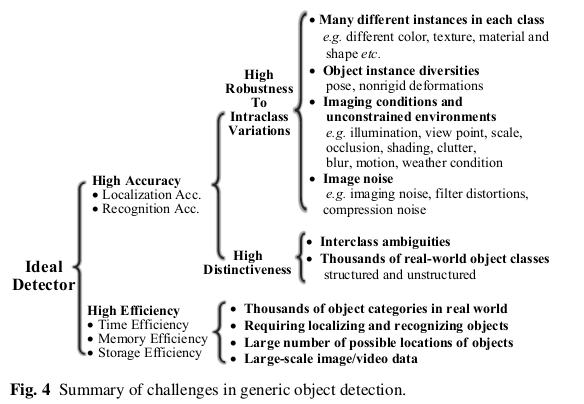
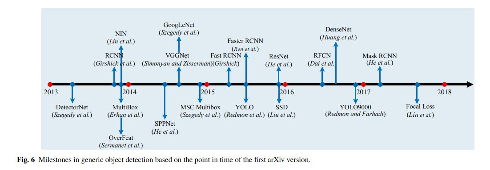
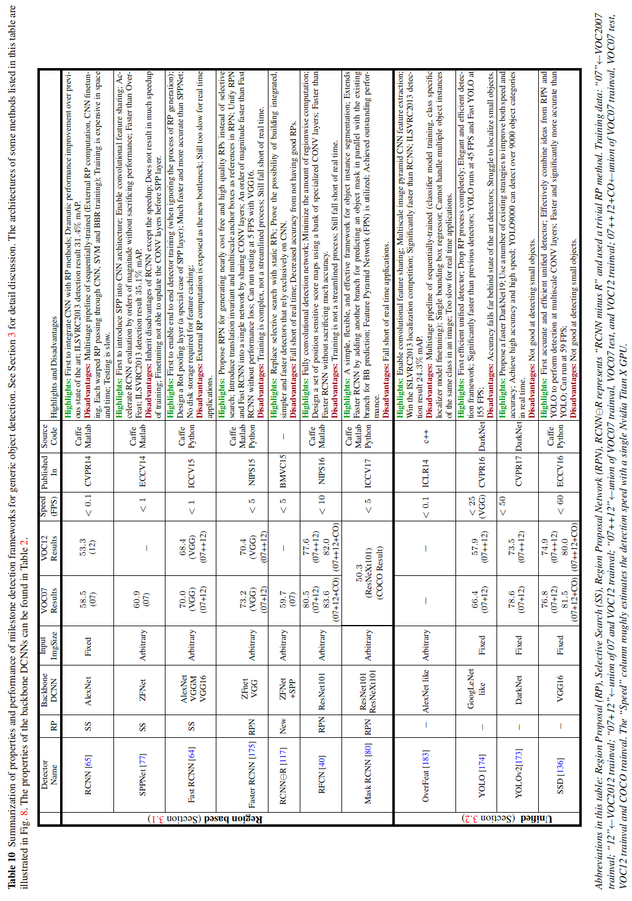

---

title: read det survey<liu2018deep> 

---

Deep Learning for Generic Object Detection: A Survey

# Abstract

>... More than 250 key contributions are included in this survey, covering many aspects of generic object detection research: leading detection frameworks and fundamental subproblems including object feature representation, object proposal generation, context information modeling and training strategies; evaluation issues, specifically benchmark datasets, evaluation metrics, and state of the art performance. ...

目标检测是cv的经典问题，典型的任务是在自然图像中定位出目标实例并确定其类别。深度学习有着从数据中直接学习特征表示的过人能力，目标检测任务因其应用而获得突破。
这篇文章致力于对这个快速发展的领域做一个全面的survey，总结深度应用于DET任务取得的成绩。本文囊括了250多个主要贡献，讨论内容涉及检测框架和多个子问题：目标特征表示、提目标候选框、背景信息建模和网络训练策略，此外还讨论了算法的评价等问题，包括：基准数据集、算法的评价指标以及当前前沿算法的表现。

# 梗概

文章有点长 好在行文流畅干净 先看看大概说了啥

* Introduction

介绍部分主要对检测任务下定义，讲历史，然后1.1做了个综述的综述

文章的其余部分主要将算法，在1.2有具体说明 ：

>The remainder of this paper is organized as follows. Related background, including the problem, key challenges and the progress made during the last two decades are summarized in Section 2. We describe the milestone object detectors in Section 3. Fundamental subproblems and relevant issues involved in designing object detectors are presented in Section 4. A summarization of popular databases and state of the art performance is given in 5. We conclude the paper with a discussion of several promising directions in Section 6.

* Section 2

    背景介绍：
    问题重述，主要挑战，研究历史

* Section 3

    具体介绍一些关键检测算法的细节
     * A 两阶段 （3.1 ）
     * B 一阶段 （3.2 ）

* Section 4

    讨论检测中的基础问题 包括上面说的特征表示，背景建模，提候选框以及其它问题。

* Section 5

    不同数据集 以及performance

[//]: #(先写到这里。。吃饭。。接下来的具体再看)

# Section 2

## 2.1 问题重述

文章开头，认为通常说的目标检测有两大类，其任务有稍微不同 [1][1]  [2][2]

*   detection of specific instance 
*   detection of specific categories

>The first type aims at <b>detecting instances of a particular object (such as Donald Trump’s face, the Pentagon building, or my dog Penny)</b>, 

>whereas the goal of the second type is to <b>detect different instances of predefined object categories (for example humans,cars, bicycles, and dogs).</b>

>Historically, much of the effort in the field of object detection has focused on the detection of a single category (such as faces and pedestrians) or a few specific categories.
In contrast, in the past several years the research community has started moving towards the challenging goal of building general purpose object detection systems whose breadth of object detection ability rivals that of humans.

然后文章在2.1中对目标类别检测进一步说明：

>Generic object detection (i.e., generic object category detection), also called object class detection [240] or object category detection, is defined as follows. 

>Given an image, the goal of generic object detection is to determine whether or not there are instances of objects from many predefined categories and, if present, to return the spatial location and extent of each instance. It places greater emphasis on detecting a broad range of natural categories, as opposed to specific object category detection where only a narrower predefined category of interest (e.g., faces, pedestrians, or cars) may be present. 

给定一张图片，通用目标检测的目的是检测其中是否存在预训练类别实例，如果有，返回每个实例的空间位置和范围。

目标类别检测关心的目标类别更广，它想实现图像中出现的所有实例类别的检测，而不仅仅是针对人脸、行人、汽车等。但是关心的更多是有形状、结构的目标（而不是云彩、天空这样的）。

对于返回的实例位置和范围信息，目前最多用的表示就是bounding box。目前也有其它形式，比如像素级分割，实例分割。越来越精细化的结果是未来的趋势。

   
## 2.2 主要挑战

通用目标检测的理想是能够 提出出一个 在图像上定位并识别出 很多类别目标 的通用目标检测器，而且兼备**准确**和**高效**的优点。

### Accuracy

挑战主要来自于：

1. the vast range of intraclass variations 
2. the huge number of object categories

类内多样和类别多样

对于1，包括固有原因和图片质量。
前者是说同一类别的目标，可能在颜色、质地、材料、形状和尺寸上相差极大。比如椅子。
后者是说不同的拍摄条件（时间、位置、天气、相机、背景、照明、视角、视距、姿态、遮挡、阴影、模糊、运动）等等

对于2，我们的生活中，出现在视野内的目标类别非常多，又快又好的检测大量的类别的难度可想而知。

### Efficiency 

社交网络，智能手机与穿戴设备产生了海量视觉数据，然而智能手机和穿戴设备的计算能力和存储空间都是很有限的，因此需要目标检测算法的高效。

挑战主要来自于 类别的多样

## 2.3 过去20年

[//]: #(说一下梗概，具体文献看论文吧。)

### from past to 1990s

最初依托模板匹配，或检测目标具体部位，比如某人的人脸

然后是几何表示(geometric representations )

很快注意力转到分类器(NN,SVM,Adaboost)+图像特征

### 1990s to early 2000s 

出现了里程碑的算法 SIFT 和DCNN

特征表示从全局转向局部，很多流行的局部特征表示算法，不受平移、缩放、旋转、光照、视点、遮挡等影响。

[//]: #(这里很有意思)

耳熟能详的：
>SIFT、Shape Contexts、Histogram of Gradients (HOG) 以及 Local Binary Patterns (LBP)

这些特征利用简单的级联或者特征编码器进行融合：

>词袋模型Bag of Visual Words 、Spatial Pyramid Matching (SPM) of BoW models 、Fisher Vectors 

### 2012 -

特征工程在cv中统治了一段时间，直到2012年DCNN创下历史纪录。

DCNN在ImageNet图像分类中的成功很快在目标检测领域擦出花火，产生出了RCNN这样开创性的算法。至此，目标检测领域算法开始迸发式生长。

# Section 3 Framework

目标特征表示和分类器检测领域，随着手工特征向深度卷积网络学习特征的转变，大步流星的向前迈进着。

相比之下，即使有了一些新工作的出现，目标检测仍是以“划窗”策略为主流。
然而随着图像像素的增加，需要检测的划窗数目也指数级的陡增,图像的多尺度和多样的长宽比也加重了搜索任务。于是检测的计算量在不断上升，对算法的效率提出了更高的要求。由此，模型串联、特征值共享、减少前置窗口计算量等方式就被吸收进各种模型中。

基本上近几年的检测算法都是在一些里程碑意义的算法基础上某些方面的改进，
里程碑意义的检测算法架构总结：

总得来说，这些检测算法能够被分为两大类：

>A. Two stage detection framework, which includes a pre-processing step for region proposal, making the overall pipeline two stage.

>B. One stage detection framework, or region proposal free framework, which is a single proposed method which does not separate detection proposal, making the overall pipeline singlestage.

## 3.1 Region Based (Two Stage Framework)

## 3.2 Unified Pipeline (One Stage Pipeline)

# 4

>Section 4 will build on the following by discussing fundamental
subproblems involved in the detection framework in greater detail,
including DCNN features, detection proposals, context modeling,
bounding box regression and class imbalance handling.

----

[1]: Grauman K., Leibe B. (2011) Visual object recognition. Synthesis lectures on artificial intelligence and machine learning 5(2):1–181 1, 2, 3

[2]: Zhang X., Yang Y., Han Z., Wang H., Gao C. (2013) Object class detection: A survey. ACM Computing Surveys 46(1):10:1–10:53 1, 2, 3, 4

