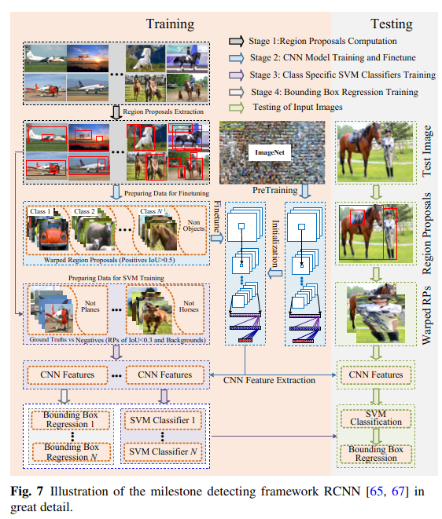
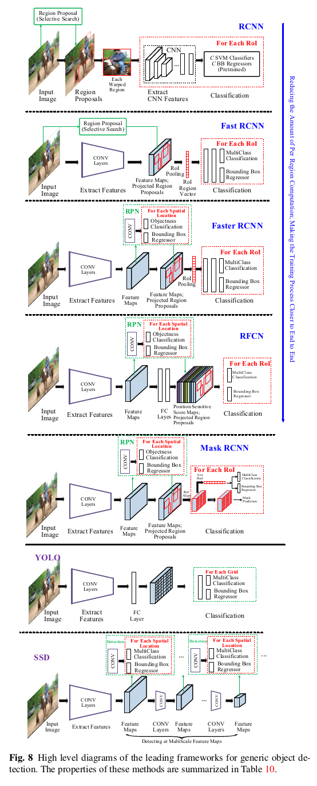

Deep Learning for Generic Object Detection: A Survey

Section 3

# Section 3 Framework

目标特征表示和分类器检测领域，随着手工特征向深度卷积网络学习特征的转变，大步流星的向前迈进着。

相比之下，即使有了一些新工作的出现，目标检测仍是以“划窗”策略为主流。
然而随着图像像素的增加，需要检测的划窗数目也指数级的陡增,图像的多尺度和多样的长宽比也加重了搜索任务。于是检测的计算量在不断上升，对算法的效率提出了更高的要求。由此，模型串联、特征值共享、减少前置窗口计算量等方式就被吸收进各种模型中。

基本上近几年的检测算法都是在一些里程碑意义的算法基础上某些方面的改进，
里程碑意义的检测算法架构总结：

总得来说，这些检测算法能够被分为两大类：

>A. Two stage detection framework, which includes a pre-processing step for region proposal, making the overall pipeline two stage.

>B. One stage detection framework, or region proposal free framework, which is a single proposed method which does not separate detection proposal, making the overall pipeline singlestage.

# 3.1 Region Based (Two Stage Framework)

基于区域的框架中，首先从图像中生成与类别无关的区域建议，然后提取区域的CNN特征，最后用一个类别特定的分类器得到区域的类别。DetectorNet，OverFeat，MultiBox and RCNN.

## RCNN

结合了CNN在图像分类上的成功 + 候选框推荐在手工特征上的成功
AlexNet + region proposal method [209]

>如上图，training in an RCNN framework consists of multistage pipelines:
>1. Class-agnostic region proposals, which are candidate regions that might contain objects, are obtained selective search [209];
>2. Region proposals, which are cropped from the image and warped into the same size, are used as the input for finetuning a CNN model pre-trained using large-scale dataset such as ImageNet;
>3. A set of class specific linear SVM classifiers are trained using fixed length features extracted with CNN, replacing the softmax classifier learned by finetuning.
>4. Bounding box regression is learned for each object class with
CNN features.

1. 类别无关的区域推选，
RCNN也有很多显著缺点

## SPPNet

在实践中发现，RCNN检测流程中的主要瓶颈还是CNN特征提取环节，对数以千计warped区域的特征提取计算量很大。
于是He 等人在RCNN算法中引入了 spatial pyramid pooling (SPP) 结构。卷积层的输入可以是任意尺寸的图片，而有固定输入的只有全连接层（FC），通过将SPP连接到卷积层的后面，可以对任意尺寸图像输出固定尺寸特征给FC层。

## Fast RCNN

相比RCNN/SPPNet独立训练后端的分类器，Fast RCNN 能够在region proposal后端 学习一个一体的分类器。

FastRCNN采用了基于跨区域的卷及计算共享的方法，还在卷积层和全连接层中间加入了一个 Region of Interest (ROI)层,来获取基于每个Region的固定长度大小的特征。
实际上，RoI池化用特征级的弯曲来近似图像级的弯曲。

而经过RoI处理的特征图将以向量的形式被喂到最后的FC层，并最终形成两个输出层：基于物体检测的Softmax概率模型和用于方法调整的特殊类别的Box回归模型。

对比RCNN和SPPNet，FastRCnn大大提高了效率，大约在训练过程中提速了2倍，在测试过程中提速了9倍。总而言之，FastRCNN拥有更高的物体检测准确度、能够更新网络所有权值的单阶段训练过程以及不需要额外的特征存储空间。

## FasterRCNN

尽管FastRCNN拥有较为出色的物体检测效率，但是它始终依赖着额外的Region Proposals，这也因此成为FastRCNN最大的瓶颈，最新研究表明，CNNs能够在最后一层卷积过程中很好的对物体进行定位，而在FC层中，这种能力稍欠。因此Region Porposals的选择性研究完全可以用CNNs进行代替，于是FasterRCNN应运而生.

Ren 等人 [175, 176] 提出了一个Region Proposal
Network (RPN) 用于生成候选框。
FasterRCNN利用单个网络完成RPN提取Region Proprsals的任务，然后利用Fast RCNN进行目标分类。

在Faster RCNN中，RPN网络和fast RCNN共享了许多卷积层。 从共享卷积层输出的特征既用于region proposal，又用于region classification。

后面还有一些细节这里不表了。

## RFCN (Region based Fully Convolutional Network)

## Mask RCNN

## Light Head RCNN

# 3.2 Unified Pipeline (One Stage Pipeline)

